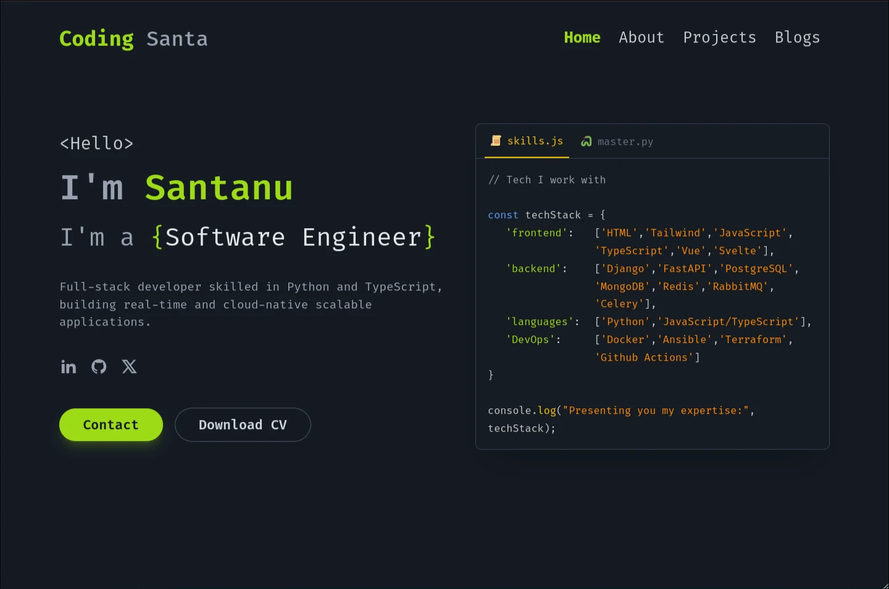

# Personal Portfolio & Blog

Welcome to my personal corner of the internet! This repository hosts the source code for my personal website, where I showcase my projects, write about my experiences, and share my thoughts on technology.

## 👨‍💻 About Me

I am a passionate developer who loves building things for the web. This portfolio serves as a central hub for my professional identity, featuring a collection of my client and personal projects, as well as a blog where I document my learning journey.

## 🛠️ Tech Stack

This project is built with modern web technologies to ensure performance, scalability, and a great developer experience:

- **Framework:** [Astro](https://astro.build/) - For building a fast, content-focused website.
- **Language:** [TypeScript](https://www.typescriptlang.org/) - For type-safe code.
- **Styling:** [Tailwind CSS](https://tailwindcss.com/) - For rapid and responsive UI development.
- **Content:** Markdown & MDX - For easy content management of blog posts and project details.
- **Deployment:** [Cloudflare Workers](https://workers.cloudflare.com/) - For high-performance edge deployment.
- **Icons:** [Remix Icon](https://remixicon.com/)

